# Practica08-Laberinto-VR
||**VICERRECTORADO DOCENTE**|**Código:** GUIA-PRL-001|
| :- | :-: | :- |
||CONSEJO ACADÉMICO|**Aprobación:** 2016/04/06|
|**Formato:** Guía de Práctica de Laboratorio / Talleres / Centros de Simulación|

|

**PRÁCTICA DE LABORATORIO**
|
| - |
|**CARRERA**: COMPUTACION|**ASIGNATURA**: HIPERMEDIAL|
|**NRO. PRÁCTICA**:|8|**TÍTULO PRÁCTICA**: Desarrollo de una aplicación de realidad virtual usando la herramienta Unity y desplegada en un dispositivo móvil Android.|
|

**OBJETIVO**

- Experimenta con aplicaciones de realidad virtual.

- Experimenta con aplicaciones de realidad aumentada.

- Distingue la diferencia entre tecnologías de realidad virtual y realidad aumentada.
|
|

**INSTRUCCIONES**
|
Este proyecto es una oportunidad para que combine y practique todo lo que aprendió en el capítulo de Realidad Virtual. Creará una experiencia de realidad virtual totalmente interactiva en forma de laberinto.

Esto le brinda la oportunidad de aplicar lo que ha aprendido con las secuencias de comandos para brindar una experiencia audiovisual completa.

***Crear la GVR Camera Rig***

Durante este paso, crearemos la cámara VR incluyendo el GvrEditorEmulator en la escena y configurando la cámara.

1. Agregue el objeto prefab GvrEditorEmulator a la escena.

2. Convierta el objeto Main Camera en un elemento hijo del objeto GvrEditorEmulator.

3. Restablece el componente Transformar del objeto Main Camera

4. Mueva el objeto GvrEditorEmulator a una ubicación conveniente para el desarrollo, por ejemplo, Posición: 0, 3, 35 y Rotación: 0, 180, 0.

5. Ingrese al modo de juego y use Alt + Mouse y Ctrl + Mouse para rotar e inclinar el ángulo de visión de la cámara.

- **Desarrollo**

Se agregan los componentes según lo especificado. Esta cámara se ubica al inicio de todos los Waypoints.

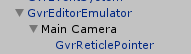

**Ubicación:** 

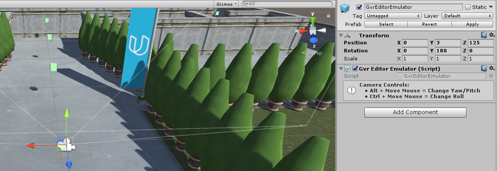

**Resultado**

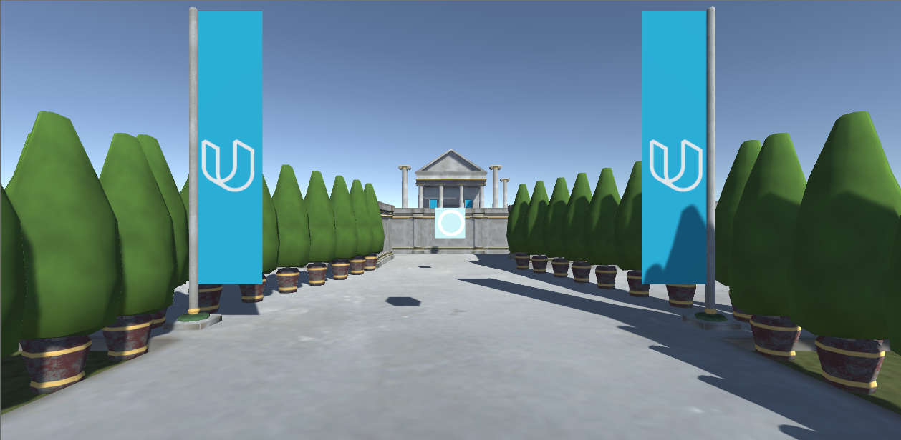

***Preparando la escena para la interacción***

Durante este paso, prepararemos la escena para la interacción configurando el puntero, el emisor de rayos y el sistema de eventos, y luego probaremos el sistema de punto de referencia incluido (waypoint).

1. Agregue el objeto prefab GvrReticlePointer a la escena como elemento secundario del objeto del Main Camera.

2. Aumente el valor de Distancia máxima de retícula para el GvrReticlePointer del

valor predeterminado de 10 a 20.
|

3. Agregue el script GvrPointerPhysicsRaycaster como componente en el objeto Main Camera.

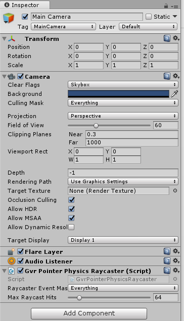

3. Agregue el objeto prefab GvrEventSystem a la escena.

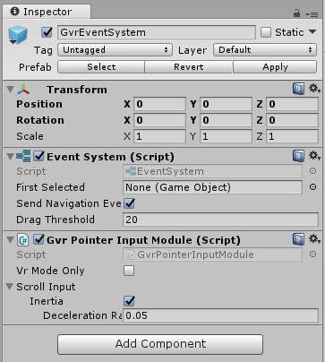

3. Ingrese al modo de juego y navegue por la escena haciendo clic en los puntos de referencia.

# ***Hacer que los objetos del juego sean interactivos***

Durante este paso haremos que la Moneda, la Llave y la Puerta sean interactivas añadiéndoles componentes de disparadores y eventos.

Se cumplieron cada uno de los requerimientos de este punto. Como pruebas se envían capturas de pantalla correspondientes.

`                    `**Coin                                           Key                                          Door**

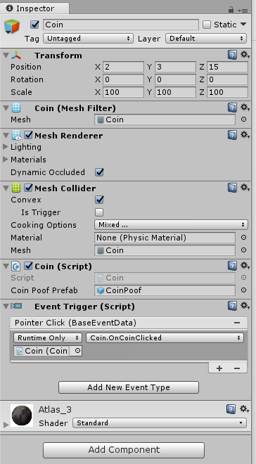

# ***Hacer la interfaz de usuario interactiva***

Durante este paso, haremos que el objeto SignPost sea interactivo al agregarle componentes de disparadores y eventos. El proceso es casi idéntico al que hicimos con la moneda, la llave y la puerta en el paso anterior, pero no necesitamos un colisionador para interactuar con los objetos del juego de la interfaz de usuario. En su lugar, debemos verificar que el objeto del juego Canvas tenga un componente Graphic Raycaster, y debido a que estamos usando GVR, reemplazaremos el Graphic Raycaster de Unity con el GvrPointerGraphicRaycaster de Google VR.

Se completó la interfaz correspondiente, para esto se cumplieron los requerimientos especificados en el informe. Se agregan las capturas según los puntos que necesitan evidencia.

**Programando el comportamiento de la moneda (coin)**

Durante este paso, programaremos el comportamiento de la moneda para que, cuando se haga clic en una moneda (coin), se reproduzca un sonido, muestre un efecto de "poof" y desaparezca.

La moneda se programó según lo especificado, añadiendo una animación de rotación y la animación de desaparición, igualmente el sonido.

# ***Programando el comportamiento de la llave (key)***

Durante este paso, programaremos el comportamiento de la llave (key) para que, cuando se haga clic en la llave, reproduzca un sonido, muestre un efecto de "poof" y desaparezca.

La llave se programó según lo especificado, añadiendo una animación de flotación y la animación de desaparición, igualmente el sonido.

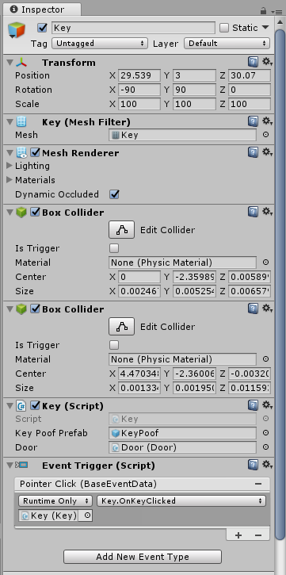

# ***Programando el comportamiento de la puerta (door)***

Durante este paso, programaremos el comportamiento de la puerta (door) para que cuando se haga clic en la llave (key), la Puerta se desbloquee y cuando se haga clic en la Puerta, se escuche un sonido y comience a girar a una posición de apertura.

Las puertas se programaron según lo especificado, añadiendo una animación de apertura y los controladores correspondientes, la cual se desbloquea al obtener la llave.

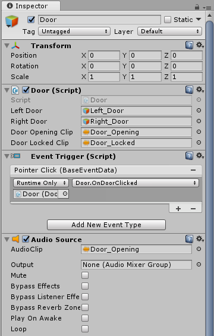

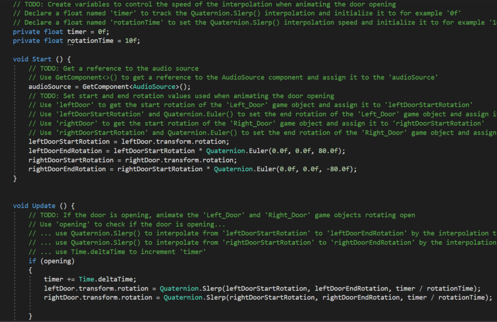

	

# ***Programando el comportamiento del SignPost***

Durante este paso, programaremos el comportamiento de SignPost para que cuando se haga clic en SignPost se reinicie el juego.

El mensaje de victoria se programa según lo especificado, agregando la funcionalidad de reset para la escena, este se encuentra dentro del templo y no se puede acceder a él hasta haber encontrado la llave y abrir la puerta.

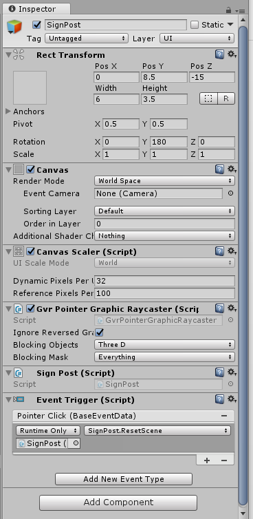

# ***Crear la funcionalidad del juego***

Durante este paso, armaremos todo y convertiremos nuestro proyecto en un juego real. Laberinto

Se agregaron las paredes y esquinas en todo el espacio disponible, según el laberinto creado, dentro de este se encuentra la llave y las monedas. La puerta no se abre hasta encontrar la llave, por lo tanto, no se puede encontrar el mensaje de victoria para reiniciar. Se agregan varios Waypoints para poder navegar en todo el mapa.

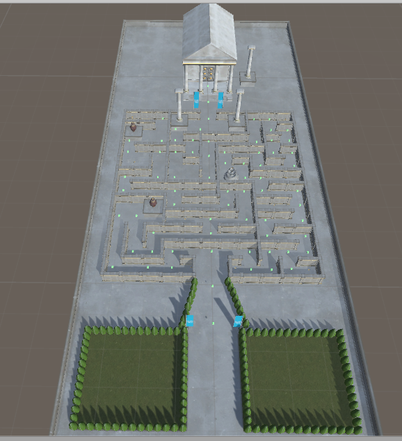

||
| - |
|**ACTIVIDADES POR DESARROLLAR**|
|1.	Crear un repositorio en GitHub con el nombre “Practica08 – Laberinto VR”|
|
2. Realizar un commit y push por cada requerimiento de los puntos antes descritos.

&emsp;a. Ignorar las carpetas Temp y Library

&emsp;b. Agregar el archivo apk comprimido en .zip

c. **La evidencia del correcto funcionamiento de la aplicación**

d. **El informe debe incluir conclusiones apropiadas.**

- Se logró implementar escenarios de realidad virtual con Unity, y que estas sean cargadas en dispositivos móviles Android. 

- El desarrollo de aplicaciones o juegos virtuales permitió diferenciar a la realidad virtual de la realidad aumentada.

e. **En el informe se debe incluir la información de GitHub (usuario y URL del repositorio de la práctica)**

**Usuario:** braulio97x

**URL: [**https://github.com/braulio97x/Practica08-Laberinto-VR.git](https://github.com/braulio97x/Practica08-Laberinto-VR.git)**

f. **En el informe se debe incluir la firma digital de los estudiantes.**

|
|3.	Luego, se debe crear el archivo README del repositorio de GitHub.|
|
4. Generar informe de los resultados en el formato de prácticas. Debe incluir:

&emsp;a. El desarrollo de cada uno de los requerimientos antes descritos.

&emsp;b. La evidencia del correcto diseño de la escena
|

||
| - |
|5.	En el archivo README del repositorio debe constar la misma información del informe de resultados de la práctica que se indica en el punto anterior.|
|
**RESULTADO(S) OBTENIDO(S)**:

- Desarrolla e integra módulos interactivos virtuales.
|
|
**CONCLUSIONES**:

- Los estudiantes podrán implementar escenarios de realidad virtual usando la herramienta Unity.
|
|**RECOMENDACIONES**:|

***Docente*:** Dr. Gabriel León Paredes, PhD.

***Firma*: **
